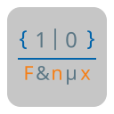

    

<h1>ATypik</h1>

## Présentation

### Qu'est-ce que c'est ?

ATypik est une librairie définissant de nouveaux types ou uniformisant ceux déjà existants.
L'utilisation est simplifiée et une documentation Doxygen est présente dans le code (également compilée).

### Modules

Les modules contenus dans libATypik sont les suivants:

* Defines
  * Définit le type TriBool et uniformise les types de base à longueur fixe
* Tabs
  * Définit les tableaux à taille fixe, variable et sous forme de map
* Utils
  * Fonctions utiles générales
* StrUtils
  * Fonctions utiles liées aux chaines de caractères
* AlgoMath
  * Exponentiation rapide (classique + modulaire)
  * Algorithme d'Euclide étendu
  * Test de Miller-Rabin
  * Nombres complexes

A noter qu'un fichier header est également inclus, _InfInt.h_.
Il est compagnon d'ATypik et provient du [repo du même nom](https://github.com/sercantutar/infint) fait par [sercantutar](https://github.com/sercantutar).

## Compatibilité

La librairie ATypik est multi-système (comme tous les outils Ashes), à condition de posséder un compilateur "GCC like" (Exemple: MinGW).

## Licence

La librairie ATypik est sous licence GPL V3 ou ultérieure. Celle-ci est appliquée à chaque fichier et peut être consultée via le document COPYING.

## Comment l'installer ?

### Dépendances

Une seule dépendance est nécessaire pour compiler libATypik:

* AScripts

Celle-ci peut être clonée et installée via mon github.  
(Le fichier _InfInt.h_ étant déjà inclus dans les sources, il n'est pas nécessaire d'en cloner le dépôt).

### Installation

Vous pouvez tout simplement executer les commandes suivantes:

    ./Windows_prepare.ps1 OU ./Linux_prepare.sh

puis

    make

et enfin

    make install

À noter que le dossier d'installation est défini par la variable d'envirronement ASHES_DIR (créée lors de l'installation d'AScripts).